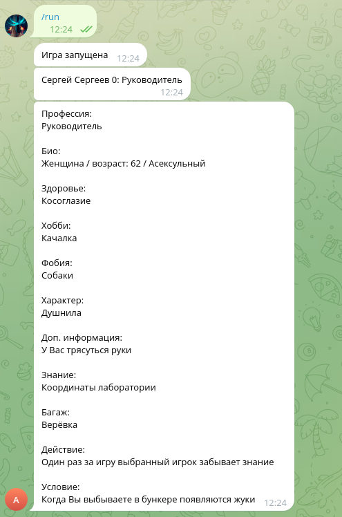

# Bunker The Game

A Telegram bot based on the table top game with the same name.

The game was made in one night at `вписка`, because we didn't have any games to play.

# Screenshots



# Run

Tested on Fedora Linux, but I'am sure, it can run on Windows also.

Install python and pyTelegramBotAPI library

```
pip install pyTelegramBotAPI
```

Set environment variable `TOKEN` to configure this bot for Telegram.

To run use

```
python main.py
```

On linux there is `start.sh` script, so you can fill token here and run it.

```
start.sh
```

For testing purposes lobby size check is commented, so if you need this check you can find it under `# TODO` comment